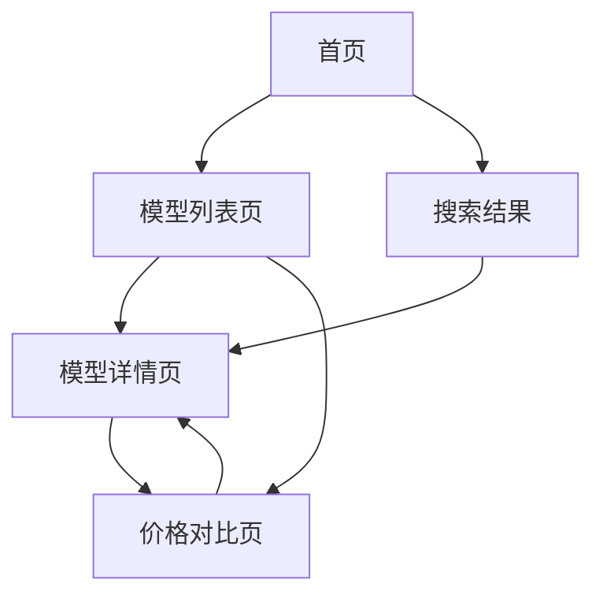

# Pricnicker AI模型聚合比价平台 - 产品需求文档

## 1. Product Overview
Pricnicker是一个AI模型聚合比价平台，帮助用户对比不同AI模型提供商的价格和性能参数。平台整合了硅基流动、AiHubMix、PPIO、MaxHub、ZenMux等主流AI模型平台的数据，为用户提供透明、便捷的模型选择和价格对比服务。

目标是成为AI模型采购的首选比价工具，帮助开发者和企业找到最具性价比的AI模型解决方案。

## 2. Core Features

### 2.1 User Roles
由于是比价平台，无需复杂的用户角色区分，所有用户均可访问完整功能。

### 2.2 Feature Module
我们的AI模型比价平台包含以下主要页面：
1. **首页**：平台介绍、搜索入口、热门模型推荐
2. **模型列表页**：完整的模型列表展示、筛选和排序功能
3. **模型详情页**：单个模型的详细信息和价格分析
4. **价格对比页**：多个模型的并排价格对比

### 2.3 Page Details

| Page Name | Module Name | Feature description |
|-----------|-------------|---------------------|
| 首页 | Hero区域 | 展示平台价值主张，包含搜索框和CTA按钮 |
| 首页 | 热门模型推荐 | 显示最受欢迎或性价比最高的模型卡片 |
| 首页 | 平台统计 | 展示已收录模型数量、支持平台数等关键指标 |
| 模型列表页 | 筛选器 | 按品牌、价格范围、上下文窗口大小等条件筛选模型 |
| 模型列表页 | 排序功能 | 按价格、性能、窗口大小等维度排序 |
| 模型列表页 | 模型卡片 | 展示模型基本信息：品牌、名称、输入输出价格、窗口大小 |
| 模型列表页 | 分页/无限滚动 | 处理大量模型数据的展示 |
| 模型详情页 | 模型信息 | 详细展示模型参数、训练数据量、技术规格 |
| 模型详情页 | 价格计算器 | 根据用户输入的token数量计算实际使用成本 |
| 模型详情页 | 相似模型推荐 | 推荐同类型或相似价位的其他模型 |
| 价格对比页 | 对比表格 | 并排展示选中模型的详细参数和价格对比 |
| 价格对比页 | 成本计算 | 基于不同使用场景计算总体成本差异 |

## 3. Core Process

用户主要操作流程：
1. 用户访问首页，了解平台功能
2. 通过搜索或浏览进入模型列表页
3. 使用筛选和排序功能找到合适的模型
4. 点击模型卡片查看详细信息
5. 选择多个模型进行价格对比
6. 使用价格计算器评估实际使用成本

## 4. User Interface Design

### 4.1 Design Style
- **主色调**：活力橙 (#FF6600)、纯白 (#FFFFFF)、纯黑 (#000000)
- **辅助色**：暖米色渐变 (#E2C495)、奶油色 (#DECEAD)、金棕色 (#CBA672)
- **按钮样式**：圆角现代风格，主按钮使用橙色渐变效果
- **字体**：Inter字体系列，标题16-24px，正文14-16px
- **布局风格**：卡片式设计，顶部导航，响应式网格布局
- **图标风格**：线性图标，统一使用Heroicons或Lucide图标库

### 4.2 Page Design Overview

| Page Name | Module Name | UI Elements |
|-----------|-------------|-------------|
| 首页 | Hero区域 | 大标题、副标题、搜索框(带自动完成)、渐变背景、CTA按钮 |
| 首页 | 热门模型推荐 | 3-4列网格布局的模型卡片，包含品牌logo、模型名称、价格标签 |
| 首页 | 平台统计 | 数字动画效果的统计卡片，图标+数字+描述的组合 |
| 模型列表页 | 筛选器 | 侧边栏或顶部横向筛选条，多选下拉框、滑块、标签选择 |
| 模型列表页 | 模型卡片 | 统一卡片设计，品牌标识、模型名称、价格对比条、关键参数 |
| 模型详情页 | 模型信息 | 分栏布局，左侧参数表格，右侧价格计算器 |
| 价格对比页 | 对比表格 | 响应式表格，固定表头，高亮差异项，颜色编码价格优势 |

### 4.3 Responsiveness
平台采用移动优先的响应式设计，支持桌面端、平板和手机端访问。在移动端优化触摸交互，筛选器改为抽屉式设计，表格支持横向滚动。