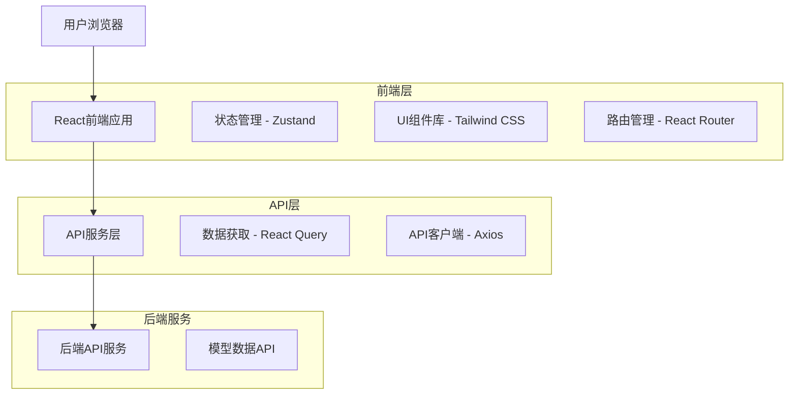
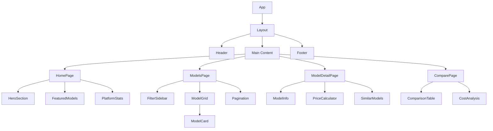
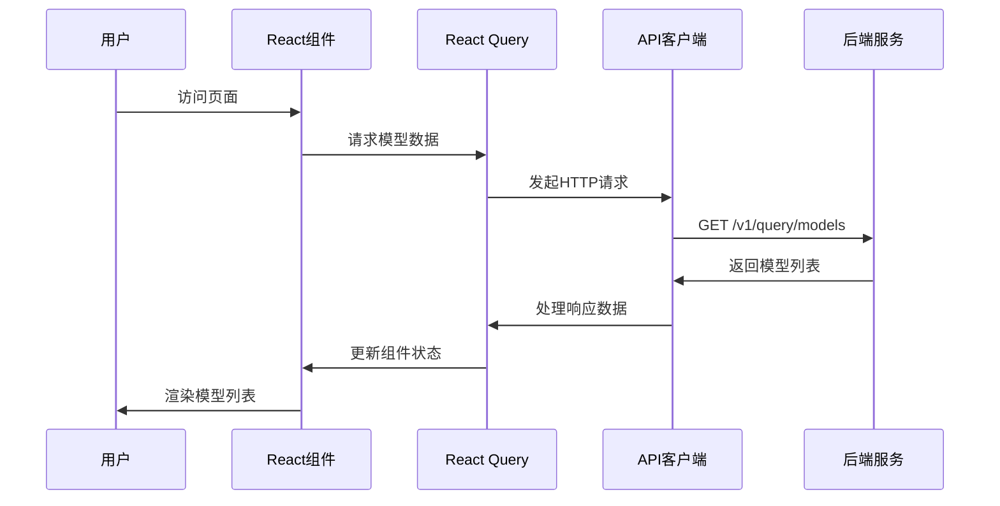
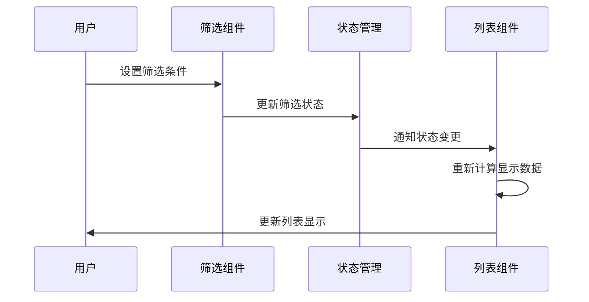

# Pricnicker AI模型聚合比价平台 - 技术架构文档

## 1. Architecture design



## 2. Technology Description

- Frontend: React@18 + TypeScript@5 + Vite@5 + Tailwind CSS@3
- 状态管理: Zustand@4
- 数据获取: @tanstack/react-query@5
- HTTP客户端: Axios@1
- 路由: React Router@6
- UI组件: Headless UI + Heroicons
- 构建工具: Vite

## 3. Route definitions

| Route | Purpose |
|-------|---------|
| / | 首页，展示平台介绍和热门模型推荐 |
| /models | 模型列表页，支持筛选和排序功能 |
| /models/:id | 模型详情页，展示单个模型的详细信息 |
| /compare | 价格对比页，多模型并排对比 |
| /search | 搜索结果页，显示搜索匹配的模型 |

## 4. API definitions

### 4.1 Core API

获取全局模型列表
```
GET /v1/query/models
```

Response:
| Param Name | Param Type | Description |
|------------|------------|-------------|
| brand | string | 模型品牌名称 |
| name | string | 模型名称 |
| data_amount | integer\|null | 训练数据量 |
| window | integer | 上下文窗口大小 |
| tokens | object | 价格信息对象 |
| tokens.input | integer | 输入token价格 |
| tokens.output | integer | 输出token价格 |
| tokens.unit | string | 价格单位 |

Example Response:
```json
[
  {
    "brand": "DeepSeek",
    "name": "DeepSeek-V3.1",
    "data_amount": 671,
    "window": 160000,
    "tokens": {
      "input": 4,
      "output": 12,
      "unit": "CNY"
    }
  },
  {
    "brand": "Anthropic",
    "name": "Claude-4-Sonnet",
    "data_amount": null,
    "window": 1000000,
    "tokens": {
      "input": 3.3,
      "output": 16,
      "unit": "CNY"
    }
  }
]
```

### 4.2 TypeScript类型定义

```typescript
interface ModelTokens {
  input: number;
  output: number;
  unit: string;
}

interface Model {
  brand: string;
  name: string;
  data_amount: number | null;
  window: number;
  tokens: ModelTokens;
}

interface ModelListResponse {
  models: Model[];
  total: number;
  page: number;
  pageSize: number;
}

interface FilterOptions {
  brands?: string[];
  priceRange?: [number, number];
  windowRange?: [number, number];
  sortBy?: 'price' | 'window' | 'name';
  sortOrder?: 'asc' | 'desc';
}
```

## 5. 前端架构设计

### 5.1 组件层次结构



### 5.2 状态管理结构

```typescript
interface AppState {
  // 模型数据
  models: Model[];
  loading: boolean;
  error: string | null;
  
  // 筛选和排序
  filters: FilterOptions;
  searchQuery: string;
  
  // 对比功能
  compareList: Model[];
  
  // UI状态
  sidebarOpen: boolean;
  theme: 'light' | 'dark';
}
```

## 6. 数据流设计

### 6.1 数据获取流程



### 6.2 筛选和搜索流程



## 7. 性能优化策略

### 7.1 数据缓存
- 使用React Query进行API数据缓存
- 设置合理的缓存时间和失效策略
- 实现乐观更新提升用户体验

### 7.2 组件优化
- 使用React.memo优化组件重渲染
- 实现虚拟滚动处理大量数据
- 懒加载非关键组件

### 7.3 代码分割
- 按路由进行代码分割
- 动态导入大型组件库
- 优化打包体积